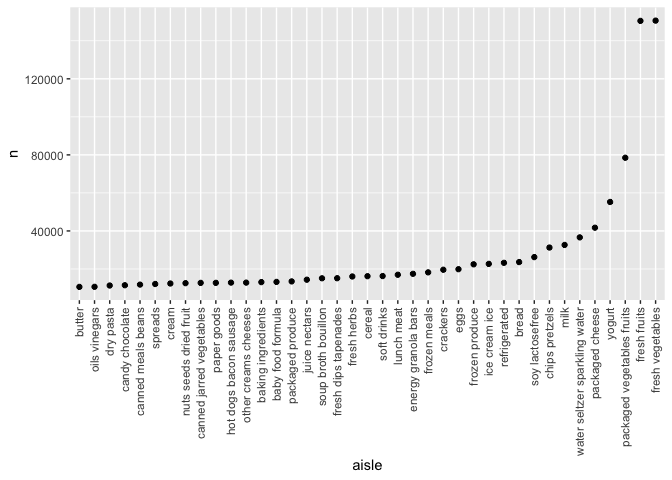
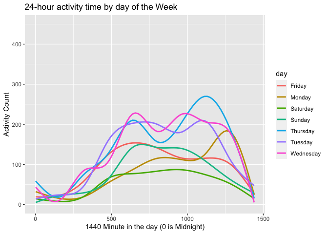
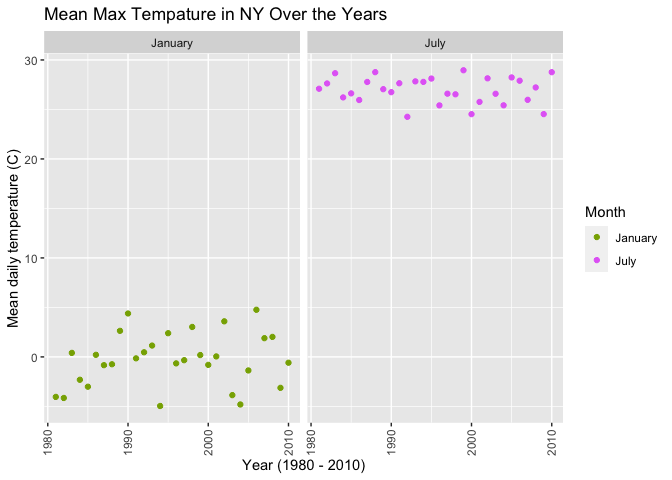
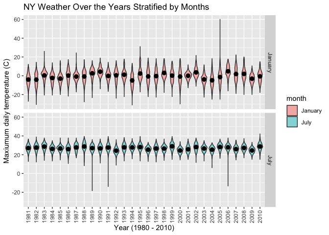

HW3
================
Amy Pitts
10/10/2020

# Problem 1

This problem uses the Instacart data. DO NOT include this dataset in
your local data directory; instead, load the data from the
p8105.datasets using:

``` r
data("instacart")
```

The goal is to do some exploration of this dataset. To that end, write a
short description of the dataset, noting the size and structure of the
data, describing some key variables, and giving illstrative examples of
observations. Then, do or answer the following (commenting on the
results of each):

``` r
head(instacart)
```

    ## # A tibble: 6 x 15
    ##   order_id product_id add_to_cart_ord… reordered user_id eval_set order_number
    ##      <int>      <int>            <int>     <int>   <int> <chr>           <int>
    ## 1        1      49302                1         1  112108 train               4
    ## 2        1      11109                2         1  112108 train               4
    ## 3        1      10246                3         0  112108 train               4
    ## 4        1      49683                4         0  112108 train               4
    ## 5        1      43633                5         1  112108 train               4
    ## 6        1      13176                6         0  112108 train               4
    ## # … with 8 more variables: order_dow <int>, order_hour_of_day <int>,
    ## #   days_since_prior_order <int>, product_name <chr>, aisle_id <int>,
    ## #   department_id <int>, aisle <chr>, department <chr>

This dataset contains 1384617 rows and 1384617 columns. This data is all
about instacart orders. Observations are at the level of items in orders
by users of the insta cart app. There are user variables/ order
variables, user ID, order ID, order data, and order hour. There are also
item variables – name, aisle, department, and some numeric codes.

Also should contain the structure of the data. For example the aisle is
realte dto the department. Also the aisle name is numberic and also is
the same as the aisle id.

  - How many aisles are there, and which aisles are the most items
    ordered from?

<!-- end list -->

``` r
instacart %>%
  count(aisle) %>%
  arrange(desc(n))
```

    ## # A tibble: 134 x 2
    ##    aisle                              n
    ##    <chr>                          <int>
    ##  1 fresh vegetables              150609
    ##  2 fresh fruits                  150473
    ##  3 packaged vegetables fruits     78493
    ##  4 yogurt                         55240
    ##  5 packaged cheese                41699
    ##  6 water seltzer sparkling water  36617
    ##  7 milk                           32644
    ##  8 chips pretzels                 31269
    ##  9 soy lactosefree                26240
    ## 10 bread                          23635
    ## # … with 124 more rows

The most things are coming from fresh vegetables and fresh friuts.

  - Make a plot that shows the number of items ordered in each aisle,
    limiting this to aisles with more than 10000 items ordered. Arrange
    aisles sensibly, and organize your plot so others can read it.

Lets make a plot

``` r
instacart %>%
  count(aisle) %>%
  filter(n > 10000) %>%
  mutate (
    aisle = factor(aisle),
    aisle = fct_reorder(aisle, n) #re-order isle according to n
  ) %>%
  ggplot(aes(x = aisle, y = n)) +
  geom_point() + 
  theme(axis.text.x = element_text(angle = 90, vjust = 0.5, hjust = 1)) #needed to tilt the words 
```

<!-- -->

  - Make a table showing the three most popular items in each of the
    aisles “baking ingredients”, “dog food care”, and “packaged
    vegetables fruits”. Include the number of times each item is ordered
    in your table.

<!-- end list -->

``` r
instacart %>% 
  filter(aisle %in% c("baking ingredients", "dog food care", "packaged vegetables fruits")) %>%
  group_by(aisle) %>%
  count(product_name) %>%
  mutate(rank = min_rank(desc(n))) %>%
  filter(rank < 4) %>%
  arrange(desc(n)) %>%
  knitr::kable()
```

| aisle                      | product\_name                                 |    n | rank |
| :------------------------- | :-------------------------------------------- | ---: | ---: |
| packaged vegetables fruits | Organic Baby Spinach                          | 9784 |    1 |
| packaged vegetables fruits | Organic Raspberries                           | 5546 |    2 |
| packaged vegetables fruits | Organic Blueberries                           | 4966 |    3 |
| baking ingredients         | Light Brown Sugar                             |  499 |    1 |
| baking ingredients         | Pure Baking Soda                              |  387 |    2 |
| baking ingredients         | Cane Sugar                                    |  336 |    3 |
| dog food care              | Snack Sticks Chicken & Rice Recipe Dog Treats |   30 |    1 |
| dog food care              | Organix Chicken & Brown Rice Recipe           |   28 |    2 |
| dog food care              | Small Dog Biscuits                            |   26 |    3 |

  - Make a table showing the mean hour of the day at which Pink Lady
    Apples and Coffee Ice Cream are ordered on each day of the week;
    format this table for human readers (i.e. produce a 2 x 7 table).

<!-- end list -->

``` r
instacart %>% 
  filter(product_name %in% c("Pink Lady Apples", "Coffee Ice Cream")) %>%
  group_by(product_name, order_dow) %>%
  summarize( mean_hour = mean(order_hour_of_day)) %>%
  pivot_wider(
    names_from = order_dow,
    values_from = mean_hour
  ) %>%
  knitr::kable()
```

    ## `summarise()` regrouping output by 'product_name' (override with `.groups` argument)

| product\_name    |        0 |        1 |        2 |        3 |        4 |        5 |        6 |
| :--------------- | -------: | -------: | -------: | -------: | -------: | -------: | -------: |
| Coffee Ice Cream | 13.77419 | 14.31579 | 15.38095 | 15.31818 | 15.21739 | 12.26316 | 13.83333 |
| Pink Lady Apples | 13.44118 | 11.36000 | 11.70213 | 14.25000 | 11.55172 | 12.78431 | 11.93750 |

# Problem 2

Accelerometers have become an appealing alternative to self-report
techniques for studying physical activity in observational studies and
clinical trials, largely because of their relative objectivity. During
observation periods, the devices measure “activity counts” in a short
period; one-minute intervals are common. Because accelerometers can be
worn comfortably and unobtrusively, they produce around-the-clock
observations.

This problem uses five weeks of accelerometer data collected on a 63
year-old male with BMI 25, who was admitted to the Advanced Cardiac Care
Center of Columbia University Medical Center and diagnosed with
congestive heart failure (CHF). The data can be downloaded here. In this
spreadsheet, variables activity.\* are the activity counts for each
minute of a 24-hour day starting at midnight.

``` r
activity = read_csv(file = "data/accel_data.csv") %>%
  janitor::clean_names()
```

    ## Parsed with column specification:
    ## cols(
    ##   .default = col_double(),
    ##   day = col_character()
    ## )

    ## See spec(...) for full column specifications.

  - Load, tidy, and otherwise wrangle the data. Your final dataset
    should include all originally observed variables and values; have
    useful variable names; include a weekday vs weekend variable; and
    encode data with reasonable variable classes. Describe the resulting
    dataset (e.g. what variables exist, how many observations, etc).

We need to pivot longer so that all the activates do not have there own
column. Currently there is 35 rows and 1443 columns which is a lot. The
idea with pivot longer is to reduce the number of columns and make more
rows. We are also going to create another `week_end_vs_day` variable
that tells us if the day is during the week or on the weekend. We also
force the variables to be the correct type.

``` r
activity_long = 
  pivot_longer(
    activity, 
    activity_1:activity_1440,
    names_to = "activity_number", 
    names_prefix = "activity_",
    values_to = "activity_minute") %>%
  mutate(
    activity_minute = as.numeric(activity_minute),
    day = factor(day),
    activity_number = as.numeric(activity_number),
    week_end_vs_day = ifelse(day_id == c(3,4), "weekend", "weekday")
  )

head(activity_long)
```

    ## # A tibble: 6 x 6
    ##    week day_id day    activity_number activity_minute week_end_vs_day
    ##   <dbl>  <dbl> <fct>            <dbl>           <dbl> <chr>          
    ## 1     1      1 Friday               1            88.4 weekday        
    ## 2     1      1 Friday               2            82.2 weekday        
    ## 3     1      1 Friday               3            64.4 weekday        
    ## 4     1      1 Friday               4            70.0 weekday        
    ## 5     1      1 Friday               5            75.0 weekday        
    ## 6     1      1 Friday               6            66.3 weekday

This results in a database with 50400 rows and 6 columns which makes
this have a lot more rows then columns than before.

  - Traditional analyses of accelerometer data focus on the total
    activity over the day. Using your tidied dataset, aggregate accross
    minutes to create a total activity variable for each day, and create
    a table showing these totals. Are any trends apparent?

<!-- end list -->

``` r
activity_long %>%
  group_by( week, day) %>%
  mutate (
    day = factor(day, levels= c("Sunday", "Monday", "Tuesday", "Wednesday", "Thursday", "Friday", "Saturday"))
  ) %>%
  summarize(total_activity = sum(activity_minute)) %>%
  pivot_wider(
    names_from = day,
    values_from = total_activity
  ) %>%
  knitr::kable()
```

    ## `summarise()` regrouping output by 'week' (override with `.groups` argument)

| week | Sunday |    Monday |  Tuesday | Wednesday | Thursday |   Friday | Saturday |
| ---: | -----: | --------: | -------: | --------: | -------: | -------: | -------: |
|    1 | 631105 |  78828.07 | 307094.2 |    340115 | 355923.6 | 480542.6 |   376254 |
|    2 | 422018 | 295431.00 | 423245.0 |    440962 | 474048.0 | 568839.0 |   607175 |
|    3 | 467052 | 685910.00 | 381507.0 |    468869 | 371230.0 | 467420.0 |   382928 |
|    4 | 260617 | 409450.00 | 319568.0 |    434460 | 340291.0 | 154049.0 |     1440 |
|    5 | 138421 | 389080.00 | 367824.0 |    445366 | 549658.0 | 620860.0 |     1440 |

  - Accelerometer data allows the inspection activity over the course of
    the day. Make a single-panel plot that shows the 24-hour activity
    time courses for each day and use color to indicate day of the week.
    Describe in words any patterns or conclusions you can make based on
    this graph.

<!-- end list -->

``` r
activity_long %>%
  ggplot(aes(x = as.numeric(activity_number), y = as.numeric(activity_minute), color=day)) +
  geom_smooth(se = FALSE) +
  labs(
    title = "24-hour activity time by day of the Week",
    x = "1440 Minute in the day (0 is Midnight)",
    y = "Activity Count"
    #caption = "Data looking at the Activity by minute"
  ) 
```

    ## `geom_smooth()` using method = 'gam' and formula 'y ~ s(x, bs = "cs")'

<!-- -->

Looking at the graph we see that at the very beginning and the very end
there is less activity which makes sense because that is closest to
midnight so the person is probably asleep. Also, most activity is in the
middle of the graph which makes sense because that is the beginning of
the day. The biggest spike is on Friday towards the end of the day so
maybe on Fridays, he has some strenuous nighttime activity.

# Problem 3

This problem uses the NY NOAA data. DO NOT include this dataset in your
local data directory; instead, load the data from the p8105.datasets
package using:

``` r
data("ny_noaa") 
```

The goal is to do some exploration of this dataset. To that end, write a
short description of the dataset, noting the size and structure of the
data, describing some key variables, and indicating the extent to which
missing data is an issue. Then, do or answer the following (commenting
on the results of each):

This data focuses on New York state from Jan 1, 1981 to Dec 31, 2010 and
looks at the snowfall. The dataset has 2595176 rows and 7 columns. The
variables of interest are the id, data which hold the year, month and
day, the `prcp` which represents the precipitations, the `snow`, `snwd`,
`tmax`, and `tmin`. Quickly glancing at the head of the data we see a
lot of missing values in the weather related data.

``` r
head(ny_noaa)
```

    ## # A tibble: 6 x 7
    ##   id          date        prcp  snow  snwd tmax  tmin 
    ##   <chr>       <date>     <int> <int> <int> <chr> <chr>
    ## 1 US1NYAB0001 2007-11-01    NA    NA    NA <NA>  <NA> 
    ## 2 US1NYAB0001 2007-11-02    NA    NA    NA <NA>  <NA> 
    ## 3 US1NYAB0001 2007-11-03    NA    NA    NA <NA>  <NA> 
    ## 4 US1NYAB0001 2007-11-04    NA    NA    NA <NA>  <NA> 
    ## 5 US1NYAB0001 2007-11-05    NA    NA    NA <NA>  <NA> 
    ## 6 US1NYAB0001 2007-11-06    NA    NA    NA <NA>  <NA>

``` r
ny_noaa %>%
  gather(key = "key", value = "val") %>%
  mutate(is.missing = is.na(val)) %>%
  group_by(key, is.missing) %>%
  summarise(num.missing = n()) %>%
  filter(is.missing==T) %>%
  select(-is.missing) %>%
  arrange(desc(num.missing)) %>%
  knitr::kable()
```

    ## Warning: attributes are not identical across measure variables;
    ## they will be dropped

    ## `summarise()` regrouping output by 'key' (override with `.groups` argument)

| key  | num.missing |
| :--- | ----------: |
| tmin |     1134420 |
| tmax |     1134358 |
| snwd |      591786 |
| snow |      381221 |
| prcp |      145838 |

This table shows us that there is a lot of missing values in the
dataset. The most in the `tmax` and `tmin` and the least in the `prcp`.
The date and the ID are not included in this table becuase they do not
have missing values.

  - Do some data cleaning. Create separate variables for year, month,
    and day. Ensure observations for temperature, precipitation, and
    snowfall are given in reasonable units. For snowfall, what are the
    most commonly observed values? Why?

We are first cleaning up the data. This involves putting the date
variable into a year, month, and day variables. We also want to force
the max and min temperature to be numeric values instead of characters
since that makes more sense with what temperature is.

``` r
ny_noaa_fixed = ny_noaa %>%
  separate(date, sep="-", into = c("year", "month", "day")) %>%
  mutate(
   year = as.integer(year),
   month = as.integer(month),
   day = as.integer(day),
   tmax = as.numeric(tmax),
   tmin = as.numeric(tmin)
  )
```

Looking at the most common snow fall value.

``` r
ny_noaa_fixed %>%
  count(snow) %>%
  arrange(desc(n)) 
```

    ## # A tibble: 282 x 2
    ##     snow       n
    ##    <int>   <int>
    ##  1     0 2008508
    ##  2    NA  381221
    ##  3    25   31022
    ##  4    13   23095
    ##  5    51   18274
    ##  6    76   10173
    ##  7     8    9962
    ##  8     5    9748
    ##  9    38    9197
    ## 10     3    8790
    ## # … with 272 more rows

The most common value of the snow variable is 0. This makes sense
because the snow only fall for less then half the year in NY because NY
experiences all 4 seasons. Thus when it is summer, early fall, or late
spring there is less likely to be a chance to have snow. The second
common values is NA or a missing value.

  - Make a two-panel plot showing the average max temperature in January
    and in July in each station across years. Is there any observable /
    interpretable structure? Any outliers?

this is data manipulation steps and then plot them first step -\> how do
we need to organize the data (group by (station, month,year), and
summarize(max temp), filter(just jan)) Do same thing for the july use
facating

(can we see global warming happening)

``` r
ny_noaa_fixed %>%
  filter(month == c(1,7)) %>%
  group_by(year, month) %>%
  summarise( mean_temp = mean(tmax, na.rm = TRUE)) %>%
  mutate(
    month = ifelse( month == 1, "January", "July")
  ) %>%
  filter(mean_temp != "NaN") %>%
    ggplot(aes(x = year, y = mean_temp)) +
      geom_line(aes(color = factor(month))) + 
      theme(axis.text.x = element_text(angle = 90, vjust = 0.5, hjust = 1)) +
      facet_grid(.~month ) +
      labs(
        title = "Mean Max Tempature in NY Over the Years",
        x = "Year (1980 - 2010)",
        y = "Mean daily temperature (C)"
      ) +
      scale_color_hue(name = "Month", h = c(100, 300))
```

    ## `summarise()` regrouping output by 'year' (override with `.groups` argument)

<!-- -->

``` r
ny_noaa_fixed %>%
  filter(month == c(1,7)) %>%
  select(year, month, tmax) %>%
  group_by(year, month) %>%
  mutate(
    month = ifelse( month == 1, "January", "July")
  ) %>%
  filter(tmax != "NA") %>%
  ggplot( aes(x = factor(year), y = tmax)) + 
    geom_violin(aes(fill = month), alpha = .5) + 
    stat_summary(fun = "mean", color = "black") +
    theme(axis.text.x = element_text(angle = 90, vjust = 0.5, hjust = 1)) +
    facet_grid(month ~.) +
    labs(
        title = "NY Weather Over the Years Stratified by Months",
        x = "Year (1980 - 2010)",
        y = "Maxiumum daily temperature (C)"
      ) 
```

    ## Warning: Removed 30 rows containing missing values (geom_segment).
    
    ## Warning: Removed 30 rows containing missing values (geom_segment).

<!-- -->

somrgng - Make a two-panel plot showing (i) tmax vs tmin for the full
dataset (note that a scatterplot may not be the best option); and (ii)
make a plot showing the distribution of snowfall values greater than 0
and less than 100 separately by year.

These are two distinct plots and then we need to join them together
probably patch work merge them to gether in some way

first plot is a scatter plot, need to do a contor plot or a bin plot

second need to filter, then use something like a box plots for each year
